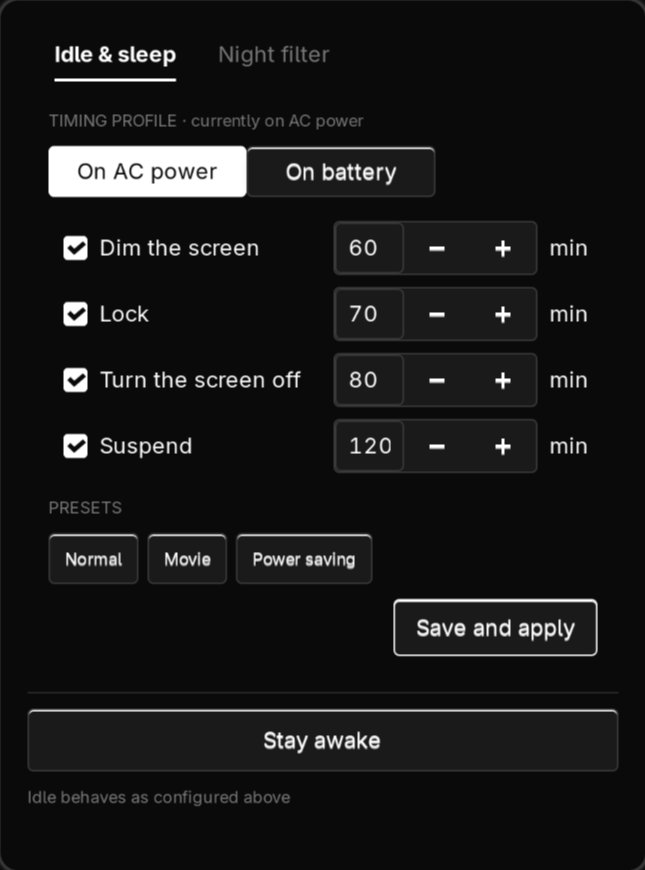
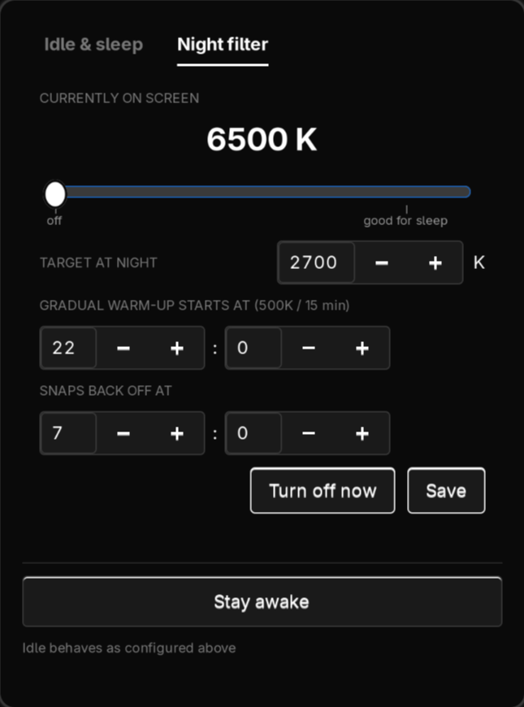

# Screen & Sleep

*[Русская версия](README.ru.md)*


A settings window for what your Hyprland session does when you stop touching it
— dim, lock, screen off, suspend — plus a scheduled night filter. It edits
`hypridle.conf` for you, keeps separate timings for mains and battery, and
switches between them on its own when you plug the charger in.

<p align="center">
  
  
</p>

## What's in it

- **A window instead of a config file.** `hypridle.conf` is generated from what
  you set. Only the block between two markers is touched — your `general`
  section, your `lock_cmd`, and anything else you wrote stays exactly as it is.
- **Two profiles, switched automatically.** One set of timings for mains, one
  for battery. The daemon notices within ~15 seconds of the charger going in or
  out, rewrites the config and restarts hypridle. You can edit the battery
  profile while plugged in — it is simply stored until it is needed.
- **Steps you can turn off individually.** Unchecking *Suspend* means the
  machine locks but never sleeps by itself. Unchecking everything means nothing
  happens ever.
- **Presets.** Normal (60/70/80/120), Movie (nothing happens), Power saving
  (5/7/8/15).
- **Stay awake.** One button holds a `systemd-inhibit` lock: no dimming, no
  locking, no sleep, whatever the timings above say. For a film or a talk.
- **A night filter with a gradual ramp.** The screen does not jump to 2700 K at
  22:00 — it steps down 500 K every 15 minutes, so the change is not something
  you notice happening. Mornings snap straight back.
- **It adopts what you already have.** On first run it reads your existing
  `hypridle.conf` and starts from those timings. Installing this does not
  silently change when your screen locks.

### The one thing worth understanding

Every step counts from the **last time you touched the mouse or keyboard** —
not from the previous step.

```
last input
    │
    ├── 60 min ──▶ dim the screen
    ├── 70 min ──▶ lock
    ├── 80 min ──▶ screen off
    └── 120 min ─▶ suspend
```

So "lock at 70" means *at the 70th minute of being idle*, not "70 minutes after
dimming". Ordering the steps by increasing time is what you almost always want;
the window warns you if they are out of order, but does not stop you.

## Requirements

- A Hyprland session (`hyprctl` is how everything is applied)
- Python 3.11+ with GTK 3 bindings — on Arch: `python-gobject`, `gtk3`
- `hypridle` — the idle chain
- `hyprsunset` — the night filter, started from `exec-once = hyprsunset`
- `brightnessctl` — the dim step
- Optional: `libnotify` (a notification when the power source changes),
  `systemd-inhibit` (part of systemd; the stay-awake button)

No root at any point. Everything lives under your home directory.

## Installation

```bash
git clone https://github.com/Whyslab/screen-sleep.git
cd screen-sleep
./install.sh
```

The installer copies the code to `~/.local/share/screen-sleep`, adds a launcher
entry, and enables the user service that carries out the schedule.

To see what it would do without doing it: `./install.sh --dry-run`.
To try it against a throwaway directory: `./install.sh --prefix /tmp/ss-test`.

### After installing

Open **Screen & Sleep** from your launcher, or bind a key:

```bash
bind = SUPER SHIFT, N, exec, python3 ~/.local/share/screen-sleep/gui.py
```

Add `--night` to open straight on the night filter tab.

The night filter needs `hyprsunset` running:

```bash
exec-once = hyprsunset      # in hyprland.conf
```

## How it works

Three pieces, deliberately kept separate:

| Piece | Job |
|---|---|
| `gui.py` | the window; writes `config.json`, applies the profile immediately |
| `daemon.py` | a loop, every 15 s: applies the schedule, watches the power source |
| `idle.py` | generates `hypridle.conf` and restarts hypridle |
| `night.py` | works out what temperature it should be right now |

`hypridle` cannot reload its config and knows nothing about batteries, so
switching profiles means rewriting the file and restarting the process. The
rewrite touches only the managed block:

```
# >>> screen-sleep: this block is managed by the Screen & Sleep window
# Edits inside this block are overwritten. Everything outside it is kept.
# Profile: on AC power.

$dim_timeout  = 3600   # 60 min — dim the backlight
$lock_timeout = 4200   # 70 min — lock the screen (starts hyprlock)

# Dim early, as a gentle warning that the lock is coming
listener {
    timeout = $dim_timeout
    on-timeout = brightnessctl -s set 10%
    on-resume = brightnessctl -r
}
...
# <<< screen-sleep
```

If the restart fails for any reason, the previous config is written back and
hypridle is restarted with it — a bad edit cannot leave you with a session that
never locks. The first version of your file is also kept as
`hypridle.conf.bak-<date>`.

### The night filter

`compute_target_temperature` answers one question: given the clock and the
schedule, what should the screen be *right now*. The daemon asks it every 15
seconds and applies the answer if it changed — which means the schedule is
correct after a suspend, after a reboot, and if the machine was off all evening.

Moving the slider by hand sets `manual_override`, and the daemon stops touching
the temperature until the next schedule boundary is crossed. Deliberate choices
survive; they just do not survive until tomorrow.

## Configuration

`~/.config/screen-sleep/config.json`, written by the window — there is no need
to edit it by hand, but nothing stops you:

```json
{
  "night": {
    "target_temp": 2700, "on_hour": 22, "on_minute": 0,
    "off_hour": 7, "off_minute": 0, "manual_override": false
  },
  "idle": {
    "ac":      { "lock": { "enabled": true, "minutes": 70 } },
    "battery": { "lock": { "enabled": true, "minutes": 7 } }
  }
}
```

Anything malformed, out of range or of the wrong type is clamped or replaced
rather than raising — a truncated file leaves you with working defaults, not a
window that will not open.

The ramp rate lives in `common.py`: `RAMP_STEP` (500 K) and `RAMP_INTERVAL_MIN`
(15 min). `RAMP_BOTH_DIRECTIONS` is off, which is why mornings are instant.

## Limitations

- **Hyprland only.** The idle chain is hypridle and the filter is hyprsunset;
  neither has a fallback. On another compositor nothing here works.
- **One monitor's worth of assumptions.** The dim step uses `brightnessctl`,
  which drives the internal panel. On a desktop with external displays it will
  not do anything useful.
- **The daemon must be running** for the schedule and for AC/battery switching.
  The window tells you if it is not, but it cannot start it for you if the user
  service was disabled.
- **The slider colour follows your GTK theme.** The window is monochrome by
  design; a theme with strong accent rules can still tint the slider.
- **No per-application inhibits.** Stay-awake is a manual switch, not something
  that notices a video is playing.

## Uninstall

```bash
./uninstall.sh              # remove the program, keep your settings
./uninstall.sh --purge      # also remove the config and saved state
```

`hypridle.conf` is deliberately left alone. The managed block inside it is
ordinary hypridle configuration and keeps working — remove it by hand, or
restore one of the `hypridle.conf.bak-*` files, if you want the old behaviour
back.

## Development

```bash
pip install pytest ruff
pytest tests/ -q
ruff check .
```

37 tests, none of which need a display or a Hyprland session. They cover the
schedule (including a window that crosses midnight, which is where this kind of
code usually breaks), config loading against truncated and hand-mangled files,
and `hypridle.conf` generation — that a second render replaces the block rather
than appending to it, that switching profiles does not accumulate listeners,
and that hand-written content outside the markers always survives.

## License

MIT — see [LICENSE](LICENSE).
